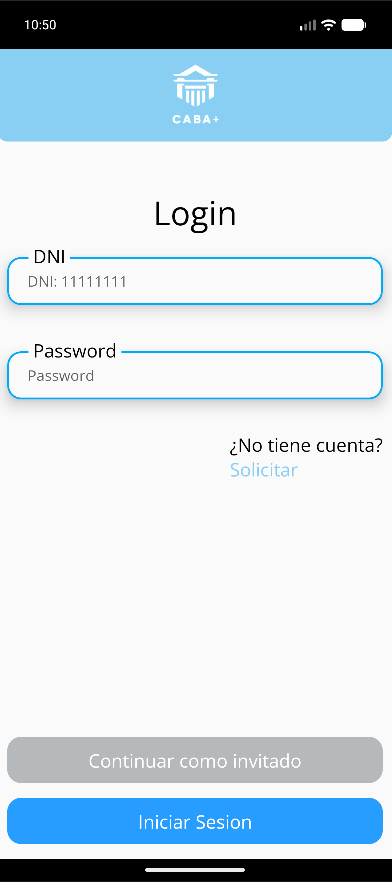
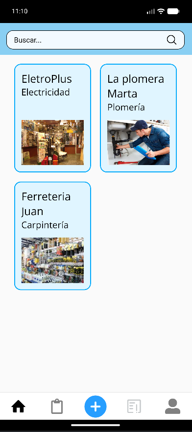
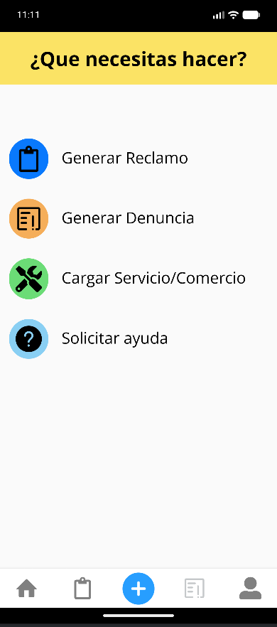
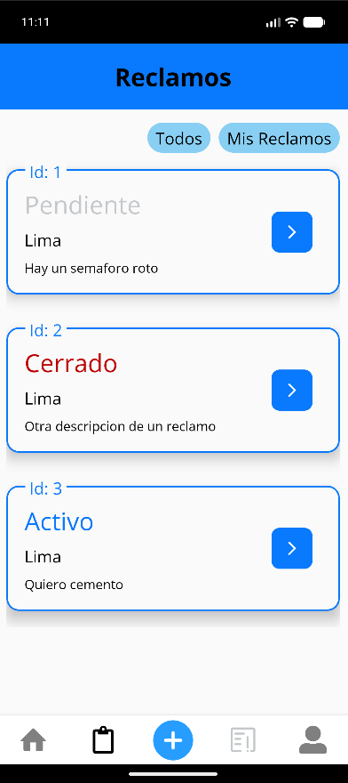
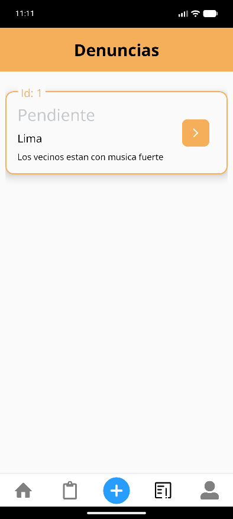
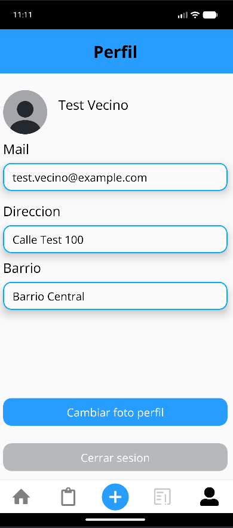

# CABA+ — Sistema de Gestión Barrial

Aplicación móvil para un municipio que permite a los vecinos generar y hacer seguimiento de reclamos de infraestructura, presentar denuncias y consultar los servicios ofrecidos por comercios y profesionales de la zona.

<p align="center">
  
  
  
  
  
  
  
</p>

## Capturas

<table>
  <tr>
    <td align="center" width="33%">
      <br>
      <sub><b>Login</b><br>Acceso por DNI, registro y modo invitado</sub>
    </td>
    <td align="center" width="33%">
      <br>
      <sub><b>Servicios y comercios</b><br>Buscador de rubros publicados en el barrio</sub>
    </td>
    <td align="center" width="33%">
      <br>
      <sub><b>Acciones rápidas</b><br>Reclamo, denuncia, alta de servicio o ayuda</sub>
    </td>
  </tr>
  <tr>
    <td align="center" width="33%">
      <br>
      <sub><b>Reclamos</b><br>Seguimiento por estado: pendiente, activo y cerrado</sub>
    </td>
    <td align="center" width="33%">
      <br>
      <sub><b>Denuncias</b><br>Historial de denuncias del vecino y su estado</sub>
    </td>
    <td align="center" width="33%">
      <br>
      <sub><b>Perfil</b><br>Datos del vecino, foto y cierre de sesión</sub>
    </td>
  </tr>
</table>

## Tabla de Contenidos
- [Descripción del Proyecto](#descripción-del-proyecto)
- [Funcionalidades](#funcionalidades)
- [Tipos de Usuarios](#tipos-de-usuarios)
- [Stack Tecnológico](#stack-tecnológico)
- [Estructura de la API Rest](#estructura-de-la-api-rest)
- [Requisitos](#requisitos)
- [Instalación y Uso](#instalación-y-uso)

## Descripción del Proyecto
El desarrollo solicitado complementará la estructura de software existente con una aplicación para dispositivos móviles que permita a los vecinos informar y controlar el seguimiento de sus reclamos, además de permitir que los comercios y profesionales de la zona se inscriban para ofrecer sus servicios.

## Funcionalidades
- **Generación de Reclamos:** Los vecinos pueden realizar reclamos sobre problemas de infraestructura como calles, plazas, oficinas públicas, etc.
- **Seguimiento de Reclamos:** Monitoreo del estado de los reclamos realizados.
- **Generación de Denuncias:** Los vecinos pueden denunciar a otros vecinos o comercios.
- **Promoción de Servicios:** Comercios y profesionales pueden publicitar sus servicios.
- **Consulta de Promociones:** Cualquier usuario puede acceder a las promociones ofrecidas por comercios y profesionales.

## Tipos de Usuarios
- **Vecinos:** Pueden generar reclamos y denuncias, y promocionar servicios.
- **Inspectores:** Pueden gestionar reclamos pero no pueden promocionar servicios.
- **Público General:** Puede acceder a las promociones sin necesidad de registrarse.

## Stack Tecnológico
| Capa | Tecnologías |
| --- | --- |
| **Mobile** | React Native 0.74, Expo 51, React Navigation, Redux Toolkit, Yup |
| **Backend** | Java 17, Spring Boot 3.2, Spring Security, Spring Data JPA / Hibernate |
| **Persistencia** | MySQL (producción), H2 (desarrollo), SQLite en el dispositivo |
| **Autenticación** | JWT (jjwt 0.12) |
| **Documentación** | OpenAPI / Swagger UI (springdoc 2.4) |

## Estructura de la API Rest
La API Rest proporcionará los siguientes endpoints principales:
- **/auth:** Manejo de autenticación y generación de claves de acceso.
- **/claims:** Gestión de reclamos, incluyendo creación, envío y consulta.
- **/reports:** Gestión de denuncias, incluyendo creación y consulta.
- **/promotions:** Gestión de promociones de comercios y servicios profesionales.

Cada endpoint contará con parámetros específicos, retornos y códigos de estado (200, 404, etc.).

La documentación interactiva queda disponible, con el backend en ejecución, en `http://localhost:8080/swagger-ui.html`.

## Requisitos
- Java 17 y Maven (incluido el wrapper `./mvnw`)
- MySQL 8 con una base llamada `AppMunicipio`
- Node.js 18+ y Expo CLI para la app móvil
- Expo Go en el dispositivo, o un emulador de Android / iOS

## Instalación y Uso

**Backend (Spring Boot)**
```bash
# Configurar credenciales de MySQL y del servicio de mail
# en src/main/resources/application.properties
./mvnw spring-boot:run
```
La API queda escuchando en `http://localhost:8080`.

**App móvil (React Native + Expo)**
```bash
cd front_end_municipio
npm install
npm start        # luego escanear el QR con Expo Go
# npm run android / npm run ios para lanzar en un emulador
```
